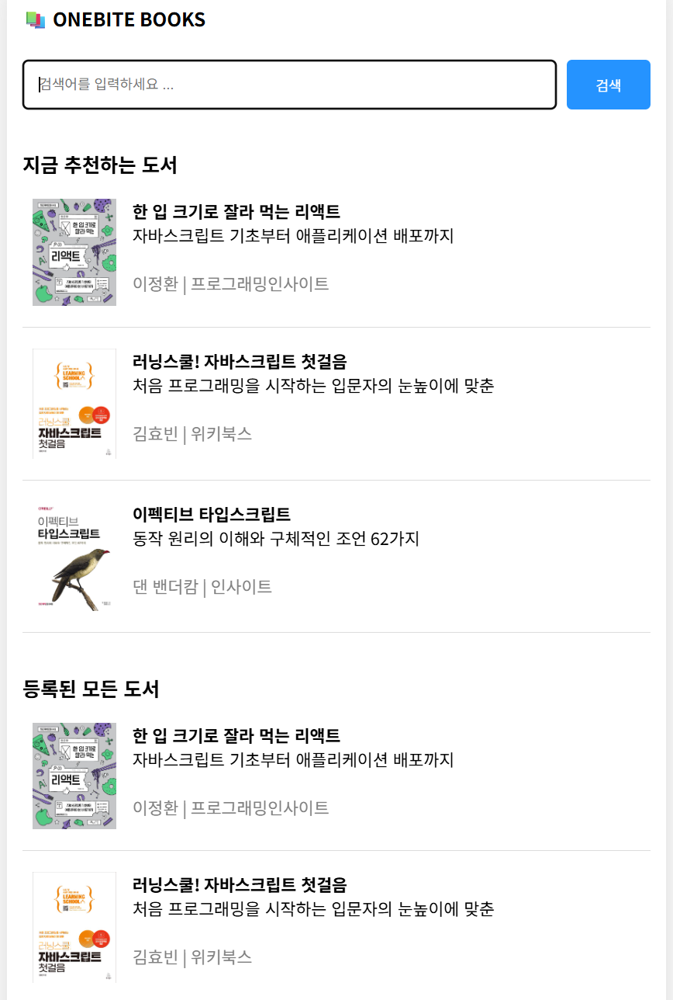

# week4

### UI 구현

- TypeScript에서 @가 의미하는 것은 src 폴더

```tsx
// index.tsx
import SearchableLayout from "@/components/searchable-layout";
import style from "./index.module.css";
import { ReactNode } from "react";
import books from "@/mock/books.json";
import BookItem from "@/components/book-item";

export default function Home() {
  return (
    <div className={style.container}>
      <section>
        <h3>지금 추천하는 도서</h3>
        {books.map((book) => (
          <BookItem key={book.id} {...book} />
        ))}
      </section>
      <section>
        <h3>등록된 모든 도서</h3>
        {books.map((book) => (
          <BookItem key={book.id} {...book} />
        ))}
      </section>
    </div>
  );
}

Home.getLayout = (page: ReactNode) => {
  return <SearchableLayout>{page}</SearchableLayout>;
};
```

```css
/* index.module.css */
.container {
  display: flex;
  flex-direction: column;
  gap: 20px;
}

.container h3 {
  margin-bottom: 0px;
}
```

```tsx
// book-item.tsx
import type { BookData } from "@/types";
import Link from "next/link";
import style from "./book-item.module.css";

export default function BookItem({
    id,
    title,
    subTitle,
    description,
    author,
    publisher,
    coverImgUrl,
}: BookData) {
    return (
        <Link href={`/book/${id}`} className={style.container}>
            
            <div>
                <div className={style.title}>{title}</div>
                <div className={style.subTitle}>{subTitle}</div>
                <br />
                <div className={style.author}>
                    {author} | {publisher}
                </div>
            </div>
        </Link>
    );
}
```

```json
// mock>books.json
[
  {
    "id": 1,
    "title": "한 입 크기로 잘라 먹는 리액트",
    "subTitle": "자바스크립트 기초부터 애플리케이션 배포까지",
    "description": "자바스크립트 기초부터 애플리케이션 배포까지\n처음 시작하기 딱 좋은 리액트 입문서\n\n이 책은 웹 개발에서 가장 많이 사용하는 프레임워크인 리액트 사용 방법을 소개합니다. 인프런, 유데미에서 5000여 명이 수강한 베스트 강좌를 책으로 엮었습니다. 프런트엔드 개발을 희망하는 사람들을 위해 리액트의 기본을 익히고 다양한 앱을 구현하는 데 부족함이 없도록 만들었습니다. \n\n자바스크립트 기초 지식이 부족해 리액트 공부를 망설이는 분, 프런트엔드 개발을 희망하는 취준생으로 리액트가 처음인 분, 퍼블리셔나 백엔드에서 프런트엔드로 직군 전환을 꾀하거나 업무상 리액트가 필요한 분, 뷰, 스벨트 등 다른 프레임워크를 쓰고 있는데, 실용적인 리액트를 배우고 싶은 분, 신입 개발자이지만 자바스크립트나 리액트 기초가 부족한 분에게 유용할 것입니다.",
    "author": "이정환",
    "publisher": "프로그래밍인사이트",
    "coverImgUrl": "https://shopping-phinf.pstatic.net/main_3888828/38888282618.20230913071643.jpg"
  },
  {
    "id": 2,
    "title": "러닝스쿨! 자바스크립트 첫걸음",
    "subTitle": "처음 프로그래밍을 시작하는 입문자의 눈높이에 맞춘",
    "description": "실무에 꼭 필요한 자바스크립트 필수 지식과 핵심 기술을 가장 쉽게 설명한 입문서!\n\n《러닝스쿨! 자바스크립트 첫걸음》은 자바스크립트의 기초부터 프런트엔드 개발의 최신 트렌드까지 웹 개발을 시작하려는 분들에게 필수적인 지식을 제공하는 책입니다. 현재 가장 인기 있는 기술인 React.js와 Next.js를 배우고 싶은 초보자부터, 이미 이 기술들을 다루고 있는 개발자 모두에게 적합합니다. \n\n실무에서 자주 사용되는 문법들을 위주로, 이해하기 쉬운 예제와 명확한 설명으로 기초적인 개념부터 심화 내용까지 단계별로 배울 수 있고, 이를 활용해 프로젝트를 개발하는 과정까지 다양한 예제와 친절한 설명으로 쉽게 이해할 수 있도록 도와주는 책입니다. 《러닝스쿨! 자바스크립트 첫걸음》을 통해 웹 개발에 첫걸음을 내딛어 보길 바랍니다.",
    "author": "김효빈",
    "publisher": "위키북스",
    "coverImgUrl": "https://shopping-phinf.pstatic.net/main_4731061/47310617618.20240426090954.jpg"
  },
  {
    "id": 7,
    "title": "이펙티브 타입스크립트",
    "subTitle": "동작 원리의 이해와 구체적인 조언 62가지",
    "description": "타입스크립트는 타입 정보를 지닌 자바스크립트의 상위 집합으로, 자바스크립트의 골치 아픈 문제점들을 해결해 준다. 이 책은 《이펙티브 C++》와 《이펙티브 자바》의 형식을 차용해 타입스크립트의 동작 원리, 해야 할 것과 하지 말아야 할 것에 대한 구체적인 조언을 62가지 항목으로 나누어 담았다.\n각 항목의 조언을 실제로 적용한 예제를 통해 연습하다 보면 타입스크립트를 효율적으로 사용하는 방법을 익힐 수 있다. 타입스크립트를 기초적인 수준에서만 활용했다면 이 책을 통해 타입스크립트 전문가로 거듭나 보자.\n\n이 책에서 다루는 내용\nㆍ 타입스크립트의 타입 시스템에 대한 자세한 이해\nㆍ 안전하고 명료한 코드를 작성할 수 있는 타입 설계\nㆍ 최소한의 타입 구문으로 완전한 안전성을 얻을 수 있는 타입 추론\nㆍ any 타입의 전략적 사용\nㆍ 의존성과 타입 선언 파일이 동작하는 원리\nㆍ 자바스크립트를 타입스크립트로 마이그레이션하는 방법",
    "author": "댄 밴더캄",
    "publisher": "인사이트",
    "coverImgUrl": "https://shopping-phinf.pstatic.net/main_3247334/32473346832.20221227204218.jpg"
  }
]
```

```css
/*book-item.module.css*/
.container {
  display: flex;
  gap: 15px;
  padding: 20px 10px;
  border-bottom: 1px solid rgb(220, 220, 220);

  color: black;
  text-decoration: none;
}

.container img {
  width: 80px;
}

.title {
  font-weight: bold;
}

.subTitle {
  word-break: keep-all;
}

.author {
  color: gray;
}
```

```tsx
// pages>search>index.tsx
import SearchableLayout from "@/components/searchable-layout";
import { useRouter } from "next/router";
import { ReactNode } from "react";
import books from "@/mock/books.json";
import BookItem from "@/components/book-item";

export default function Page() {
  return (
    <div>
      {books.map((book) => (
        <BookItem key={book.id} {...book} />
      ))}
    </div>
  );
}

Page.getLayout = (page: ReactNode) => {
  return <SearchableLayout>{page}</SearchableLayout>;
};
```

```tsx
// [id].tsx
import style from "./[id].module.css";

const mockData = {
  id: 1,
  title: "한 입 크기로 잘라 먹는 리액트",
  subTitle: "자바스크립트 기초부터 애플리케이션 배포까지",
  description:
    "자바스크립트 기초부터 애플리케이션 배포까지\n처음 시작하기 딱 좋은 리액트 입문서\n\n이 책은 웹 개발에서 가장 많이 사용하는 프레임워크인 리액트 사용 방법을 소개합니다. 인프런, 유데미에서 5000여 명이 수강한 베스트 강좌를 책으로 엮었습니다. 프런트엔드 개발을 희망하는 사람들을 위해 리액트의 기본을 익히고 다양한 앱을 구현하는 데 부족함이 없도록 만들었습니다. \n\n자바스크립트 기초 지식이 부족해 리액트 공부를 망설이는 분, 프런트엔드 개발을 희망하는 취준생으로 리액트가 처음인 분, 퍼블리셔나 백엔드에서 프런트엔드로 직군 전환을 꾀하거나 업무상 리액트가 필요한 분, 뷰, 스벨트 등 다른 프레임워크를 쓰고 있는데, 실용적인 리액트를 배우고 싶은 분, 신입 개발자이지만 자바스크립트나 리액트 기초가 부족한 분에게 유용할 것입니다.",
  author: "이정환",
  publisher: "프로그래밍인사이트",
  coverImgUrl:
    "https://shopping-phinf.pstatic.net/main_3888828/38888282618.20230913071643.jpg",
};

export default function Page() {
  const {
    id,
    title,
    subTitle,
    description,
    author,
    publisher,
    coverImgUrl,
  } = mockData;

  return (
    <div className={style.container}>
      <div
        className={style.cover_img_container}
        style={{ backgroundImage: `url('${coverImgUrl}')` }}
      >
        
      </div>
      <div className={style.title}>{title}</div>
      <div className={style.subTitle}>{subTitle}</div>
      <div className={style.author}>
        {author} | {publisher}
      </div>
      <div className={style.description}>{description}</div>
    </div>
  );
}
```

```css
/*[id].module.css*/
.container {
  display: flex;
  flex-direction: column;
  gap: 10px;
}

.cover_img_container {
  display: flex;
  justify-content: center;
  padding: 20px;

  background-position: center;
  background-repeat: no-repeat;
  background-size: cover;

  position: relative;
}

.cover_img_container::before {
  position: absolute;
  top: 0px;
  left: 0p;
  width: 100%;
  height: 100%;
  background-color: rgba(0, 0, 0, 0.7);
  content: "";
}

.cover_img_container > img {
  z-index: 1;
  max-height: 350px;
  height: 100%;
}

.title {
  font-size: large;
  font-weight: bold;
}

.subTitle {
  color: gray;
}

.author {
  color: gray;
}

.description {
  background-color: rgb(245, 245, 245);
  padding: 15px;
  line-height: 1.3;
  white-space: pre-line;
  border-radius: 5px;
}
```

```tsx
// types.ts
export interface BookData {
  id: number;
  title: string;
  subTitle: string;
  author: string;
  publisher: string;
  description: string;
  coverImgUrl: string;
}
```



인덱스 페이지


서치 페이지


북 페이지

### 사전 렌더링과 데이터 페칭

- 리액트에서 백엔드 서버로부터 데이터를 불러오는 방법
    1. 불러온 데이터를 보관할 State 생성
    2. 데이터 페칭 함수 생성
    3. 컴포넌트 마운트 시점에 fetchData 호출 → **이후에 데이터 페칭 발생**
    4. 데이터 로딩 중일 때의 예외 처리
    - 단점 : 초기 접속 요청부터 데이터 로딩까지 오랜 시간이 걸림
- Next.js는 사전 렌더링을 사용하기 때문에 문제점 해결 가능
    - **사전 렌더링 중에** 데이터 페칭 발생 → 데이터 요청 시점이 매우 빨라짐
    
    
    
- 빌드 타임에도 사전 렌더링 할 수 있도록 제공
    
    
    
- 다양한 사전 렌더링 방식
    1. 서버 사이드 렌더링 (SSR)
        - 가장 기본적인 사전 렌더링 방식
        - 요청이 들어올 때마다 사전 렌더링을 진행
    2. 정적 사이트 생성 (SSG)
        - 빌드 타임에 미리 페이지를 사전 렌더링
    3. 증분 정적 재생성 (ISR)

### SSR 서버 사이드 렌더링

```tsx
// index.tsx
import SearchableLayout from "@/components/searchable-layout";
import style from "./index.module.css";
import { ReactNode, useEffect } from "react";
import books from "@/mock/books.json";
import BookItem from "@/components/book-item";
import { InferGetServerSidePropsType } from "next";

export const getServerSideProps = () => {
  // 컴포넌트보다 먼저 실행되어서, 컴포넌트에 필요한 데이터 불러오는 함수

  console.log("서버사이드프롭스에요");

  const data = "hello";

  return {
    props: {
      data,
    },
  };
};

export default function Home({
  data,
}: InferGetServerSidePropsType<typeof getServerSideProps>) {
  console.log(data);

  useEffect(() => {
    console.log(window);
  }, []);

  return (
    <div className={style.container}>
      <section>
        <h3>지금 추천하는 도서</h3>
        {books.map((book) => (
          <BookItem key={book.id} {...book} />
        ))}
      </section>
      <section>
        <h3>등록된 모든 도서</h3>
        {books.map((book) => (
          <BookItem key={book.id} {...book} />
        ))}
      </section>
    </div>
  );
}

Home.getLayout = (page: ReactNode) => {
  return <SearchableLayout>{page}</SearchableLayout>;
};
```


확인 가능