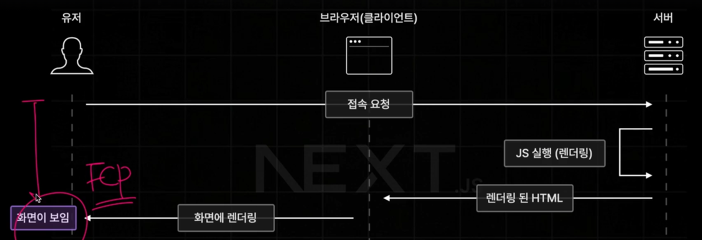
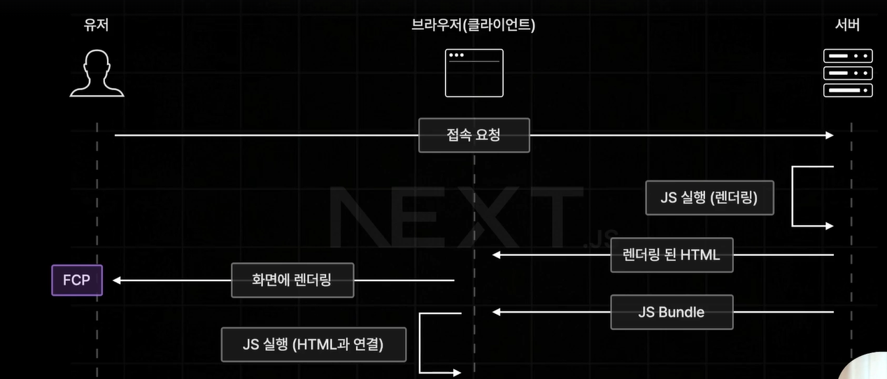
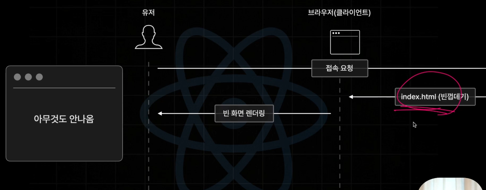
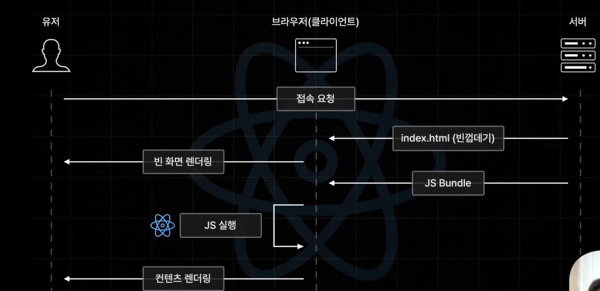
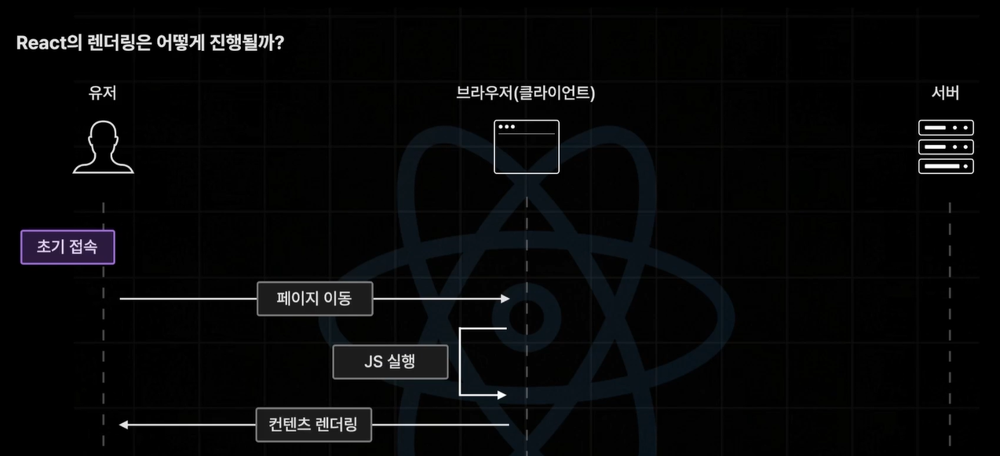
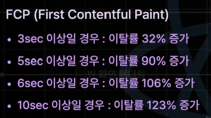
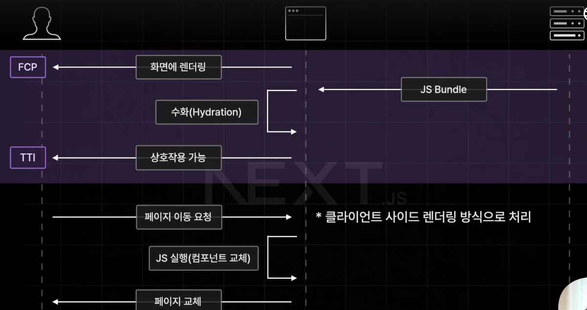

# Section01

## 1. 강의 소개

**-typescript 잘 모른다면?**

https://ts.winterlood.com <-typescript 설명

**-강의 계획**

페이지 라우터(4~5시간) -> 앱 라우터(9~10시간)

**-router에서 배우는 내용**

- React Server Component
- Data, Page Caching
- Streaming
- Sever Action 등

**-Next.js에서 제공하는 라우터**

- 페이지 라우터: Next 초창기부터 제공되어 오던 구 버전의 라우터
- 앱 라우터
  : Next 13버전과 함께 처음으로 공개된 신규 라우터

2024년 기준 앱 라우터는 아직 과도기를 겪고 있고, 앱 라우터부터 배우면 페이지 라우터에서 무엇을 개선했는지 알 수 없음.

# Section02

## 1.1 Next.js를 소개합니다

**Next.js**

: React.js 전용 웹 개발 framework로, React.js를 보다 더 강력하고 편하게 사용할 수 있는 기능들을 제공함.

: React+ 페이지 라우팅, 빌트인 최적화 기능 등의 일종의 React 확장판

: 카카오페이지, 인프런 등이 Next.js를 통해 만들어짐

**Next.js 특징**

: Next.js는 Library가 아닌 Framework이기 떄문.

-> React: UI 개발을 위한 JavaScript Library

**Framework vs Library 차이**

1.기능 구현의 주도권이 누구에게 있는가

-> Library: 주도권을 개발자가 가짐. 기능 구현을 원하는 방향으로 진행함.

=> 자유도가 높음

=> 기본 기능 외 제공 X (주요기능 제외한 그 이외의 모든 기능들은 직접 만들어서 써야함)

->Framework: 주도권을 Framework가 가짐. 프레임워크가 제공하는 기능을 이용하거나 허용하는 범위 내에서만 추가 도구 사용가능

=> 자유도가 낮음

=> 거의 모든 기능을 제공 O (페이지 라우팅, 최적화, Server Pre Rendering 등)

\*자유도: 너무 높아도 문제가 될 수 있음

## 1.2 Next.js 사전렌더링 이해하기

**사전 렌더링**

 \*렌더링된 HTML: 이미 사전에 렌더링이 완료된 HTML을 보내줌

\*JS실행 (렌더링): JS 코드(React 컴포넌트)를 HTML로 변환하는 과정

\*화면에 렌더링: HTML 코드(실제 콘텐츠)를 브라우저가 화면에 그려내는 작업

: 브라우저의 요청에 사전에 렌더링이 완료된 HTML을 응답하는 렌더링 방식

: CLient Side Rendering의 단점을 효율적으로 해결하는 기술

-> 장점1- 사전 렌더링 방식 이용 : React.js의 렌더링 방식인 CSR 단점 해결함.

-> 빠른 FCP 달성

수화(Hydration): HTML과 JS 연결 -> 상호작용(interaction) 가능 (TTI-Time To Interactive)

: 장점2- 빠른 페이지 이동(React App 장점 그대로 클라이언트 사이드 렌더링 방식으로 처리)

**\* Client Side Rendering(CSR)**

: React.js 앱의 기본적인 렌더링 방식

: 클라이언트(브라우저)에서 직접 화면을 렌더링 하는 방식

: 장점 - 초기 접속 이후 페이지 이동이 매우 빠르고 쾌적하다

->JS Bundle: 이 서비스에서 접근 가능한 모든 컴포넌트 코드가 존재함.

: 단점 - 초기 접속 속도가 느리다

->초기 접속 요청이 발생한 시점으로부터 실제 화면에 렌더링되는 순간까지 오래 걸림. **(FCP- First Contentful Paint)**

-> 컨텐츠 렌더링을 하기 위해 index.html, JS Bundle도 받아오고 JS도 실행해야하기 때문.

**\*FCP(First Contentful Paint)**

FCP가 느릴수록 사용자 이탈률이 급속도로 증가함

**Next.js에서의 최초 접속 이후 페이지 이동 요청 방식**

: 클라이언트 사이드 렌더링 방식으로 처리

: 별도의 페이지 서버를 요청하지 않고 직접 브라우저 측에서 자바스크립트 코드를 실행해서 component를 교체함

-> 초기 접속 요청 과정에서 JS Bundle파일 즉, React app을 전달해줬기 때문에 가능함.

## 1.3 실습용 백엔드 서버 세팅하기

실습용 서버가 필요한 이유: 실전과 같은 환경에서 다양한 예제를 실습하기 위함.

**-백엔드 서버 세팅 방법**

1.실습용 백엔드 서버 다운로드

2.Supabase 가입 및 프로젝트 생성

3.npm i

4.Supabase DB초기화 `npx prisma db push`

5.Table Editor 확인 -> Book, Review 자동 생성

6.`npm run seed`

7.`npm run start`

8.localhost 들어가기 (localhost:12345, /api, /books)

\*npx prisma studio (localhost:5555)

**주의 사항**

무료 버전: 일주일동안 백엔드 서버에 접속하지 않을 시 중지 상태가 됨

복구 시키는 방법: Dashboard -> project클릭 -> Restore project 버튼 클릭

복구가 잘 되는지 확인하는 방법: Dashboard -> Project is restoring 되는지 확인. (시간 오래걸리는 것이 싫다면 New Project로 다시 만들기)

## 1.4 본격적인 학습에 앞서

1section: Next.js랑 어떤 기술인지, 사전 렌더링, 실습용 백엔드 서버 세팅

2section: 페이지 라우터

3section: 앱 라우터

사전 렌더링: 페이지 라우터, 앱 라우터 모두에 공통적으로 적용
