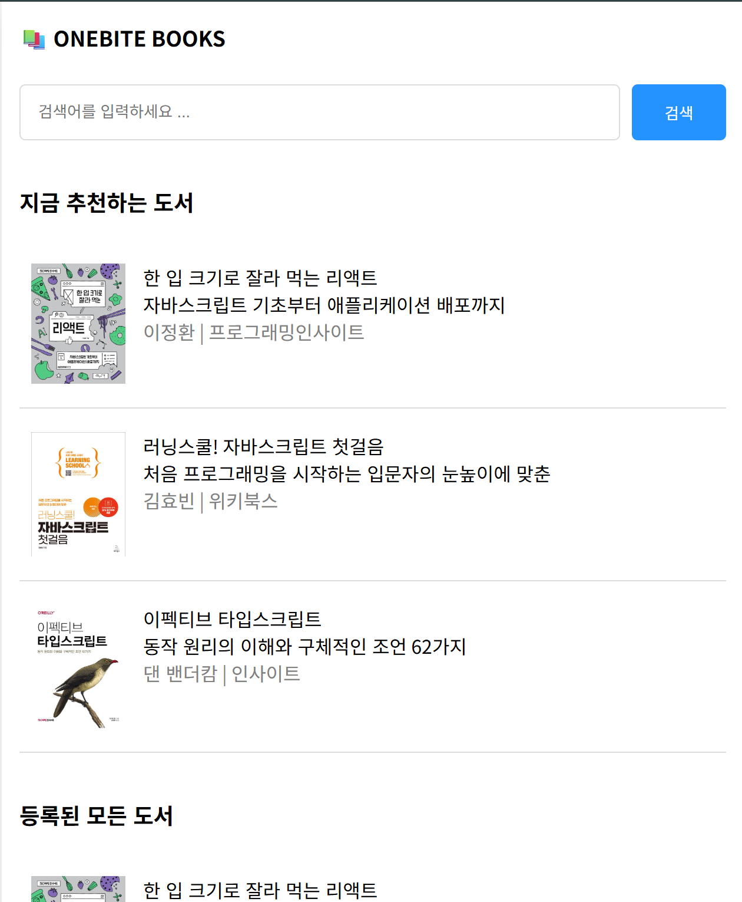
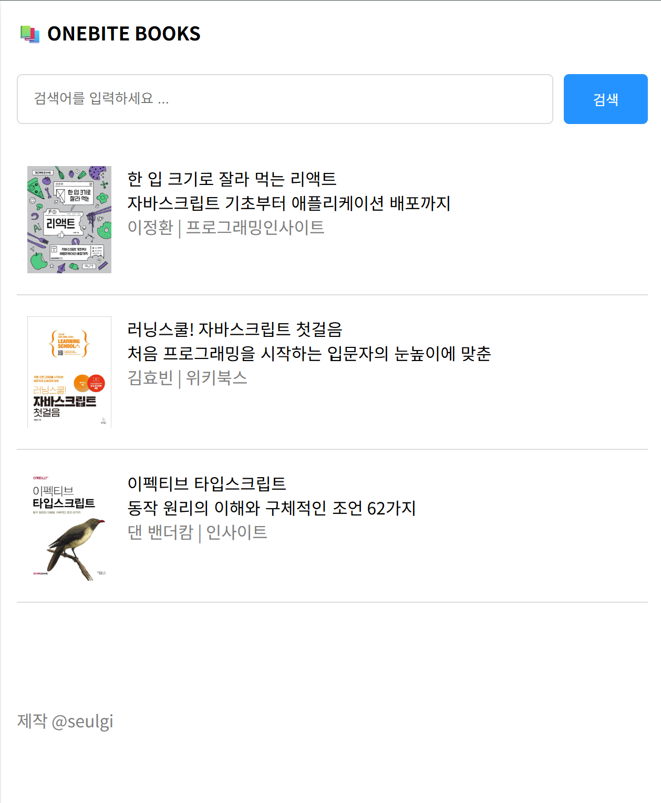
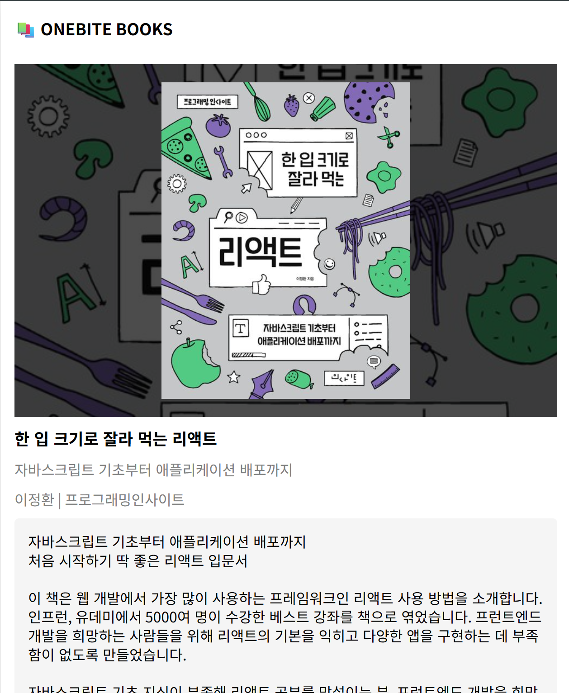
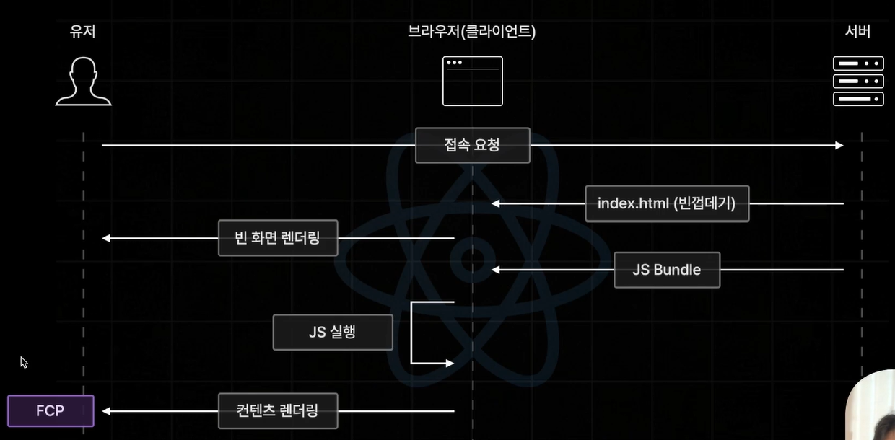
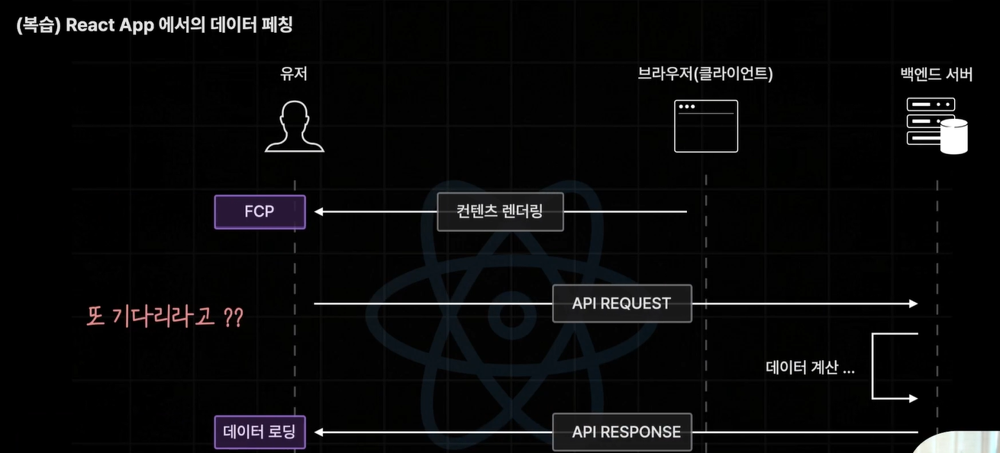
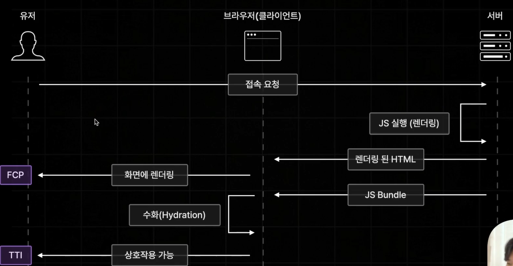
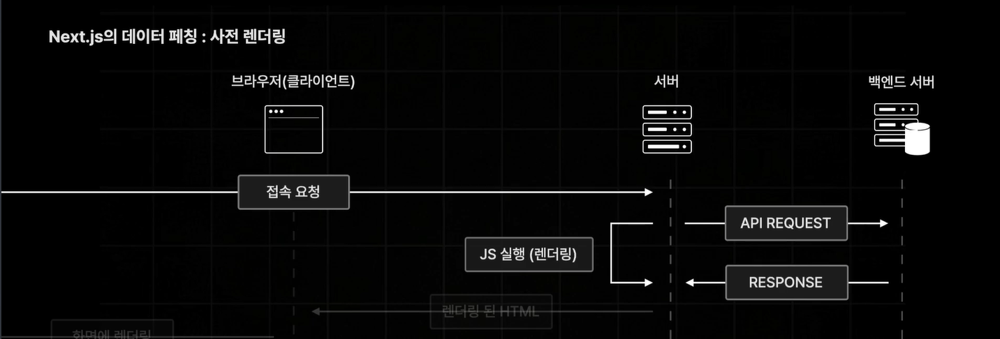
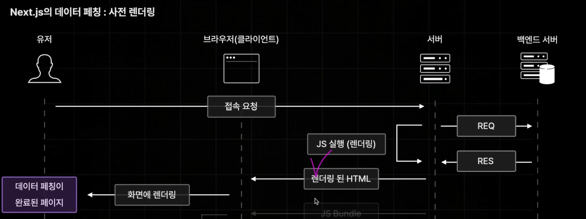
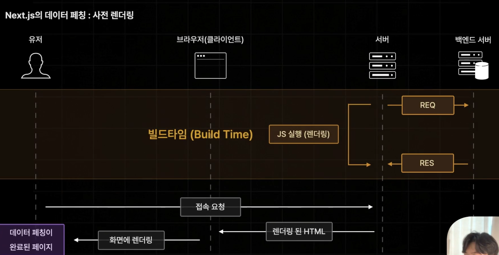

## 한입북스 UI 구현하기

`index` page

`search` page

`book/1` page

## Next.js의 사전 렌더링과 데이터 페칭

목데이터가 아닌 실습용 백엔드 서버와 연결하는 데이터 페칭 기능 사용하기

**React App에서의 데이터 페칭**

1. 불러온 데이터를 보관할 State 생성

2. 데이터 페칭 함수 생성

3. 컴포넌트 마운트 시점에 fetchData 호출

4. 데이터 로딩중일 때의 예외처리

-> 컴포넌트 마운트 이후에 발생함

-> 단점: 초기 접속 요청부터 데이터 로딩까지 오랜 시간 걸림

**Next.js의 데이터 페칭: 사전 렌더링**

-> 사전 렌더링중 데이터페칭 발생함(당연히 컴포넌트 마운트 이후에도 발생 가능)

->데이터 요청 시점이 매우 빨라지는 장점이 있음

만약 사전렌더링 되는 시간이 오래걸린다면?

빌드타임에 할 수 있도록 설정 가능

**Next.js의 다양한 사전 렌더링**

1.서버사이드 렌더링(SSR)

- 가장 기본적인 사전 렌더링 방식

- 요청이 들어올 떄 마다 사전 렌더링을 진행 함

  2.정적 사이트 생성(SSG)

- 방금 살펴본 사전 렌더링 방식

- 빌드 타임에 미리 페이지를 사전 렌더링 해 둠

  3.증분 정적 재생성(ISR)

- 향후에 다룰 사전 렌더링 방식

## SSR 1. 소개 및 실습

서버 사이드 렌더링 (SSR-Server Side Rendering)

`export const getServerSideProps = () => {`

`//컴포넌트보다 먼저 실행이 되어서, 컴포넌트에 필요한 데이터 불러오는 함수`

`};`
